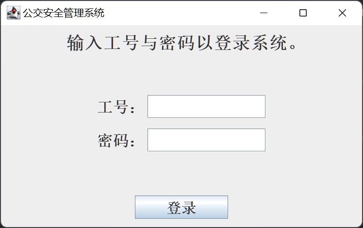
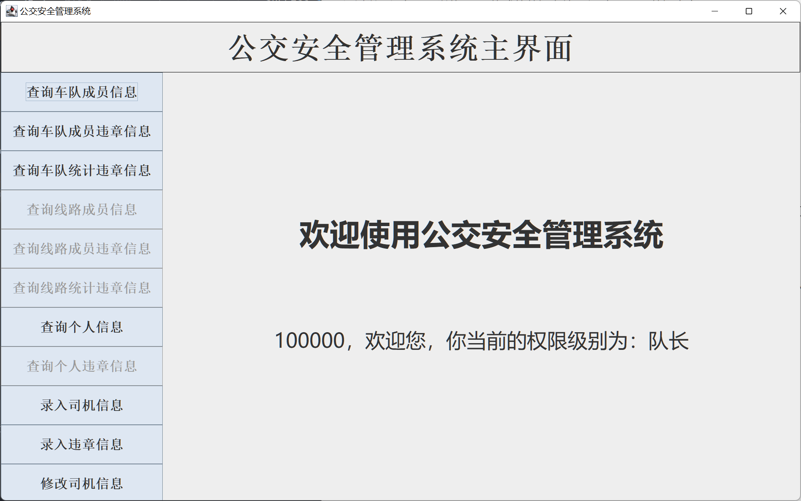
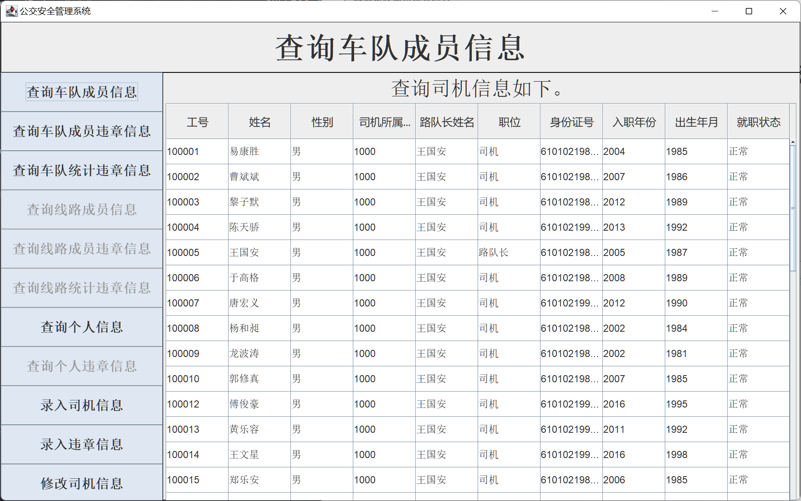
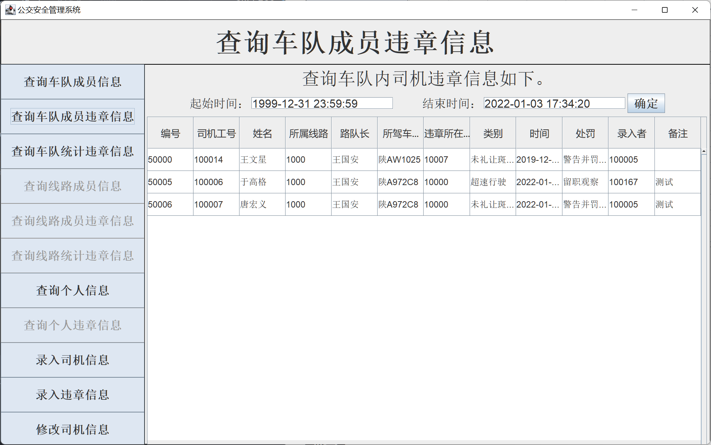
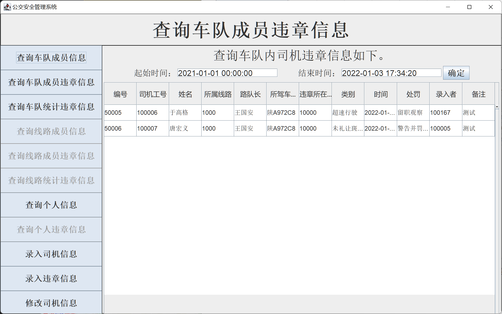
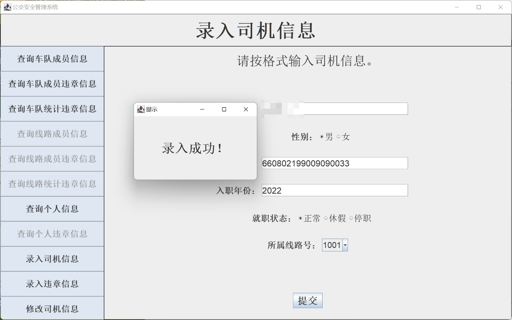
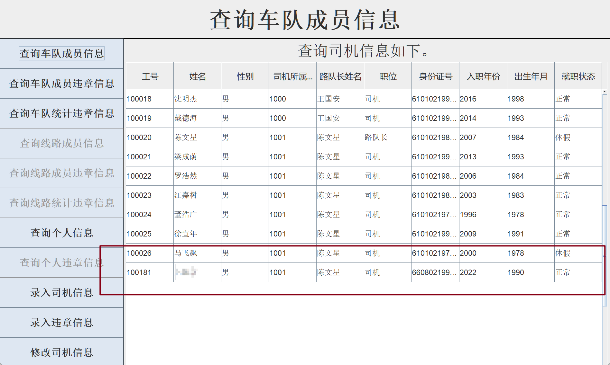
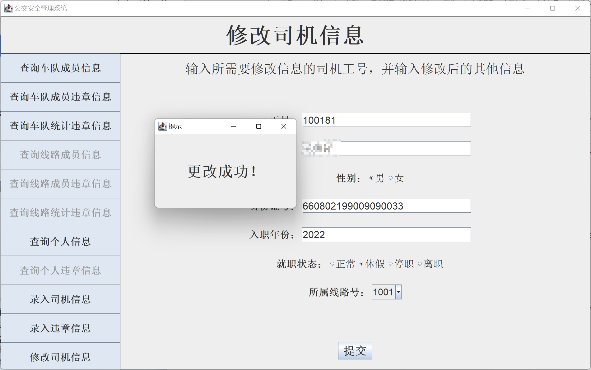
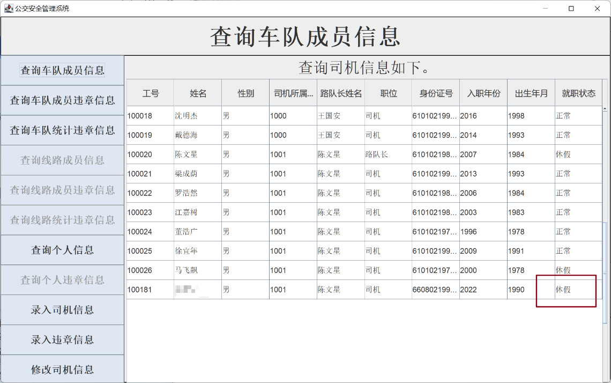

# Bus Safety Management System

## 概述

本项目为数据库系统的课程设计题目，在题目给予基本需求的情况下，要求独立完成需求分析、数据库设计、前后端程序设计等，最终目标为开发设计一个可用的、具有前台交互界面的数据库管理系统。

### 题目要求

要求开发一个公交安全管理系统用于公交公司对旗下车队、司机的违章信息进行管理。通过公交安全管理系统可以对数据库进行访问，可以使用 *Java*、*Python*、*C* 等集成开发环境。

**需求的相关语义**

1. 公交公司有若干个车队，每个车队下有若干条线路； 
2. 公交公司有若干辆汽车，每辆车属于一条线路； 
3. 每个车队有一名队长，他只有管理工作，不开车； 
4. 每条线路有若干名司机，其中有一名路队长，除开车外，还承担管理工作；每名司机只在一条线路上开车； 
5. 司机开车时会产生违章，包含：闯红灯、未礼让斑马线、压 线、违章停车等；
6. 队长、路队长负责将司机的违章信息输入到系统，包含：司 机、车辆、车队、线路、站点、时间、违章等。

**系统实现功能**

1. 录入司机基本信息，如工号、姓名、性别等； 
2. 录入汽车基本信息，如车牌号、座数等；
3. 录入司机的违章信息；
4. 查询某个车队下的司机基本信息；
5. 查询某名司机在某个时间段的违章详细信息；
6. 查询某个车队在某个时间段的违章统计信息，如：2次 闯红灯、4次未礼让斑马线等。


### 完成效果

*1.0* 版本基本满足了题目所需的功能，并且着重考虑了数据库的可维护性，数据库关系模式均有较高范式级别，同时建立了若干角色、用户子模式，在数据库的持续维护和拓展上留有充足的空间。以下为本项目的一些亮点。

#### 1. 一个完整可用的数据库管理系统，包含了前台可视化交互界面，后台以及数据库部分

该程序面向的受众主要是缺乏计算机相关知识的司机职业，为了程序的易用性，除了后台程序以及数据库的部分外，设计了简易又好上手的前台程序，使得广大的司机朋友也能通过图形化界面方便地操作。

#### 2. 数据库的设计经过考量，具有较高的可维护性

从原始的需求分析出发，一步步经历数据流图的建立、数据字典的建立，得到较为笼统的设计框架后，进一步进行概念结构设计，主要包括 E-R 图的设计，确保 E-R 图的设计合理，不出现环等结构。

数据库建立阶段，进行 E-R 图到关系模型的转换，以及为了安全地进行数据库的各类权限分配，依据该系统的不同适用人群，分别为其建立了不同的角色以及相应的用户子模式，各角色均有用其实际权限相当的数据库访问权限，通过角色和用户子模式的建立，保障了数据库的安全，以及具备足够的可维护性和可拓展性。

### 程序开发环境

**操作系统**

​	*Windows 11, version 21H2*

**编程语言**

​	数据库设计采用 *SQL* 语言，数据库管理系统后台采用 *Java* 语言编写，前台使用 *Java* 语言搭配 *swing* 组件编写。

**开发工具**

​	设计阶段，数据流图采用 *Notability* 绘制；数据字典，关系模式设计等采用 *Excel* 进行；

​	概念结构设计阶段，E-R 图采用 *ERwin* 软件制作；

​	数据库设计方面，*DBMS* 采用 *MySQL 8.0*，搭配图形化交互界面 *MySQL WorkBench CE* ；

​	*Java* 开发采用 *IntelliJ IDEA*，后端通过接口 *JDBC* 与 *MySQL* 数据库连接，GUI 界面设计采用 *swing* 组件。


## 程序演示

完成对数据库的搭建、对应的管理系统编写，以及相应数据集的编写。通过一系列测试，系统顺利完成了预期中的功能。

### 测试数据集

为了较为完善地对程序进行测试，模仿真实情景以及本数据库的设计特定，编写了具有一定规模的数据集用于测试。数据集具有以下特点。

- 本测试集包含 *3* 家公交公司，旗下有若干车队，车队有若干线路。
- 所有线路下总共包含约 100 个站点，其中某些站点同时用于多条线路。
- 所有线路内共包含约 *50* 辆公交汽车，以及共计约 *180* 左右的职员，其中包含队长，路队长以及司机。

站点以及线路数据来源主要为[西安公交(xbus.cn)](http://www.xbus.cn/)。

通过以下语句，可以将 `csv` 格式的数据文件导入到 *MySQL* 数据库中。

```sql
LOAD DATA INFILE 'C:\\ProgramData\\MySQL\\MySQL Server 8.0\\Uploads\\gongjiaogongsi.csv' INTO TABLE 公交公司
FIELDS TERMINATED BY ','
LINES TERMINATED BY '\r\n'
IGNORE 1 LINES;
```


### 公交安全管理系统

采用 *Java* 来编写后台与数据库交互的业务逻辑，以及使用 *swing* 组件来编写前端交互界面。实现了公交安全管理系统的基础功能，满足设计预期。

**登陆界面**

启动程序，首先弹出登录界面，在此，用户可以输入**工号**与**密码**登录系统。密码统一默认设置为 `123456`。



正确输入工号与密码后，登入系统，会显示管理系统的主界面。

**主界面**

主界面中，最上方的栏目为当前所处的位置，左侧的栏目为功能选项，**不同权限级别的人登录该系统，可用的功能选项也不一样。**其中当前权限级别不可用的功能会设置为灰色，不可选中。



**查询面板**

当前我们采用了车队 “100” 的队长 “10000” 身份进行登录。选择 “查询车队成员信息” 功能，主面板中返回了我们需要的信息，即车队 “100” 的所有成员的信息。



选择查询车队成员违章信息，同样可以得到我们所需要的结果。



该页面同时可以**指定时间戳**范围，对指定时间内的违章信息筛选展示。例如指定时间范围为 2021年 1 月 1 日 至今，返回结果如下。



其余查询面板类似。

**录入面板**

录入面板可以对司机信息与违章信息进行录入，以司机信息录入为例，输入相关信息，点击录入按钮，即可完成信息录入。**队长只能录入其管辖车队所属线路下的司机，体现在选择所属线路号时，只能选择管辖车队下的线路号。**



此时再查询车队内成员信息，可以发现成功添加。



**修改面板**

在修改面板中，队长可以对车队范围内的司机的信息进行修改。只需要输入司机的工号，输入修改后的其余信息，即可完成对其信息修改。

修改工号为 '100181' 的司机信息，使其就职状态变更为 ’休假‘。



查询结果，修改成功。



至此，利用 “队长” 身份登录，对公交安全管理系统的三类功能（查询，录入，修改）都进行了较为详细的介绍。其他功能效果类似，不同身份的用户登录后可用功能不同但类似，不作赘述。
